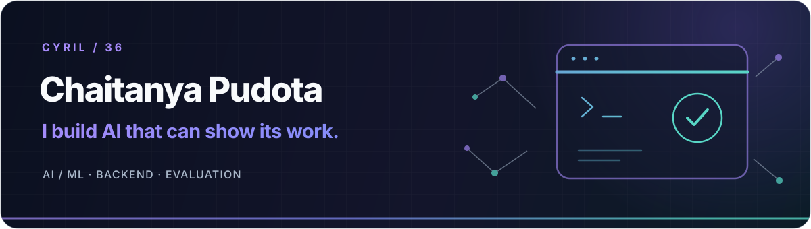

  
    
  <a href="https://github.com/Cyril-36?tab=repositories">Projects</a> ·
  <a href="https://www.linkedin.com/in/chaitanya-pudota-796528294/">LinkedIn</a> ·
  <a href="https://github.com/Cyril-36/portfolio">Portfolio code</a>
    
  AI with receipts. Backends with guardrails. A little bit of chaos, carefully tested.

##  Hey, I'm Cyril 👋

I'm **Chaitanya Pudota**, a B.Tech CSE student working across **AI/ML and backend engineering**. I like the exciting part of building with models, but I care just as much about the part after the demo: where the answer came from, whether the numbers check out, and what happens when a dependency fails.

`current side quests:` RAG · tool-using agents · data products · evaluation · practical ML

> My build loop: **make it → measure it → break it → fix it → ship it.**

##  Selected builds

| Project | The interesting bit |
| :-- | :-- |
| **[ClientAtlas](https://github.com/Cyril-36/clientatlas-rag)** | A multi-tenant knowledge workspace with hybrid retrieval, page-level citations, and PostgreSQL row-level security. If an answer cannot support its claims, it abstains. |
| **[Tally](https://github.com/Cyril-36/tally-ai-data-analyst)** | An AI data analyst where the model chooses a bounded analysis plan, while backend code runs the SQL, calculates the figures, and checks the claims. |
| **[CallKavach](https://github.com/Cyril-36/callkavach)** | A second-device scam-call assistant for Hindi, Telugu, and English. Warnings must quote the caller's words and pass fixed rules. |
| **[PictoPy](https://github.com/Cyril-36/PictoPy)** | A desktop photo gallery built with Tauri, React, Rust, and Python, with local image analysis and search. |

More experiments, prototypes, and side quests live in <a href="https://github.com/Cyril-36?tab=repositories">the repository list</a>.

##  Toolbox

**Languages** `Python` `TypeScript` `JavaScript` `C++` `SQL`  
**Apps & APIs** `FastAPI` `React` `Next.js` `PostgreSQL` `Docker`  
**ML & data** `PyTorch` `scikit-learn` `retrieval` `evaluation`  
**Everyday tools** `Git` `GitHub Actions` `Linux`

##  How I build

- **Show the source.** Retrieval, citations, and traceable calculations make an answer inspectable.
- **Let code do the counting.** Models can choose within a bounded task; validators and deterministic logic own the important numbers and rules.
- **Test the awkward paths.** Ambiguity, failures, isolation, and replay deserve as much attention as the happy demo.

##  Commit pulse

  
    
  <picture>
    <source media="(prefers-color-scheme: dark)" srcset="https://raw.githubusercontent.com/Cyril-36/Cyril-36/output/github-contribution-grid-snake-dark.svg" />
    <source media="(prefers-color-scheme: light)" srcset="https://raw.githubusercontent.com/Cyril-36/Cyril-36/output/github-contribution-grid-snake.svg" />
    
  </picture>

  
<b>More GitHub stats ↗</b>

   
  

    
    
  

##  Say hi

If you're building something around **useful AI, reliable backends, or thoughtful evaluation**, I'd love to see it. Reach me on **[LinkedIn](https://www.linkedin.com/in/chaitanya-pudota-796528294/)** or open a discussion on one of my public projects.

  Thanks for dropping by. Now back to the side quests ✨

<!-- Created with GPRM (https://gprm.itsvg.in/) as a starting point; customized for this profile. -->
