  
  <h2>hey, i'm Cyril 👋</h2>
  AI/ML · backend · RAG · evaluation
    
  
  
  
    
  

##  Stack

  

##  Pulse

  
  
    
  

##  Contributions

  <picture>
    <source media="(prefers-color-scheme: dark)" srcset="https://raw.githubusercontent.com/Cyril-36/Cyril-36/output/github-contribution-grid-snake-dark.svg" />
    <source media="(prefers-color-scheme: light)" srcset="https://raw.githubusercontent.com/Cyril-36/Cyril-36/output/github-contribution-grid-snake.svg" />
    
  </picture>

##  Builds

**[ClientAtlas](https://github.com/Cyril-36/clientatlas-rag)** · cited answers  
**[Tally](https://github.com/Cyril-36/tally-ai-data-analyst)** · checked numbers

  make → measure → break → fix → ship ✦

